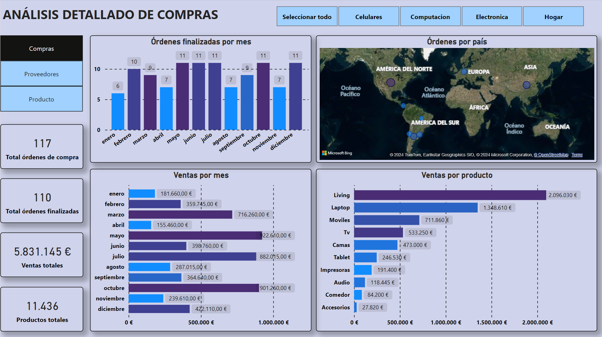
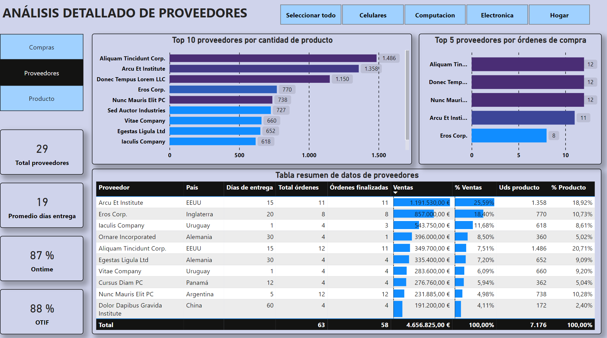
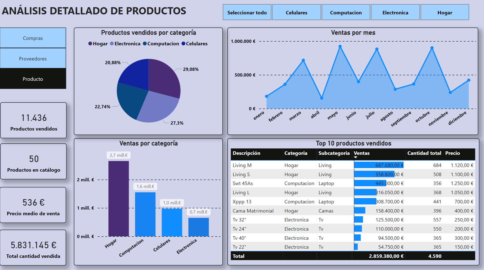
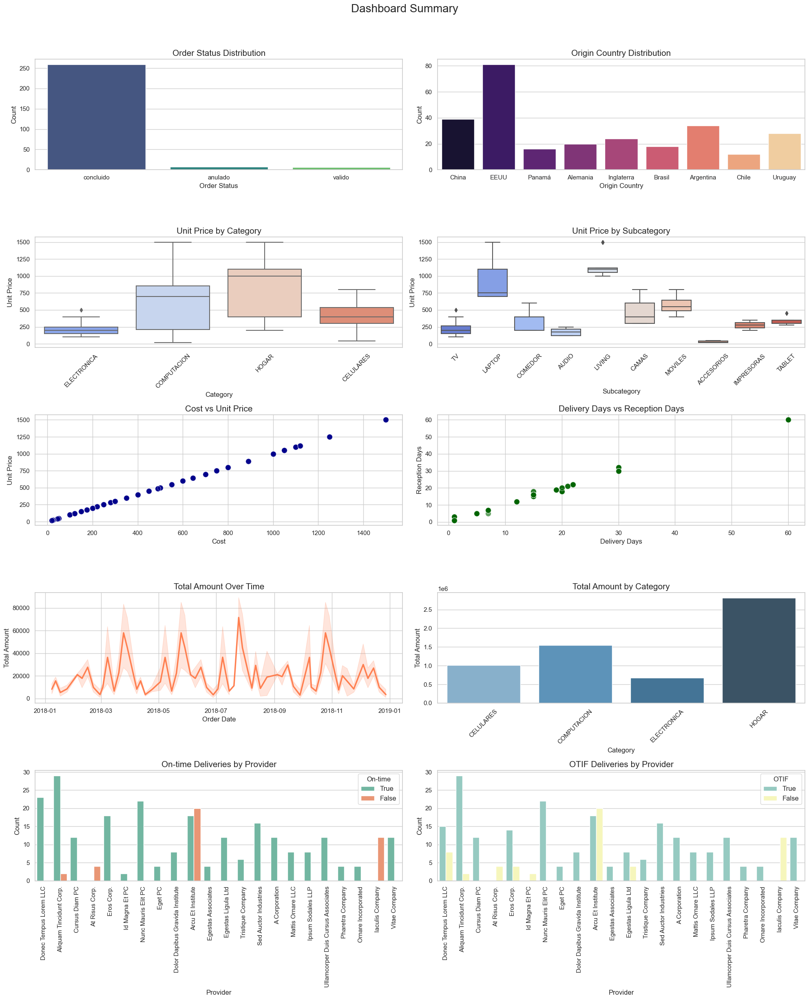

# 📊 Supply Chain Project 📊

Welcome to the **Supply Chain** repository created with Power BI! 
This project aims to provide an interactive and detailed analysis of key metrics of a supply chain to support strategic decision making.

## 📋 Introduction

This repository contains a comprehensive analysis of supply chain data using Power BI and Python. The project includes interactive visualizations, key metrics, and detailed reports to help in strategic decision making.

## 🎯 Objectives

- 🎯 Provide an interactive and detailed analysis of supply chain metrics.
- 📊 Support strategic decision making with key performance indicators (KPIs).
- 📈 Identify patterns and trends over time.
- 📦 Analyze the performance of suppliers and products.

## ⚙️ Functionality

- 📈 Interactive visualizations with pivot charts and tables.
- 📊 Analysis of key metrics such as ontime, OTIF, delivery days, sales, and orders.
- 📅 Temporal analysis to identify patterns and opportunities.
- 📋 Detailed reports and dashboards.

## 🛠️ Tools Used

- **Power BI**: For creating interactive dashboards and visualizations.
- **Python**: For data extraction, transformation, and loading (ETL) processes.
- **Pandas**: For data manipulation and analysis.
- **Seaborn & Matplotlib**: For creating visualizations in Python.

## 🔄 Development Process

### ETL Process

- **Extraction**: Data obtained from Excel files.
- **Transformation**: 
  - 🗂️ Combining tables using Power Query.
  - 🧹 Data cleaning: Elimination of duplicates, treatment of null values, and data normalization.
  - 📈 Data enrichment: Aggregation of calculated columns and data transformation to improve analysis.
- **Load**: Integration of transformed data into Power BI for analysis and visualization.

### DAX Metrics

Various metrics have been created using **DAX (Data Analysis Expressions)** to provide detailed and customized analysis:
- 📊 **KPIs calculation**
- 📏 **Calculated measures**: Creation of custom measures for specific analyses.
- 📋 **Calculated columns**: Adding additional columns to enrich the data.
- 🔍 **Filtering and segmentation**: Use of DAX to apply filters and dynamic segmentations to the data.

## 📊 Results

### Power BI Dashboard

The Power BI dashboard includes:
- **Purchases**: General view of all purchases.
  
- **Suppliers**: Detailed analysis of suppliers.
  
- **Products**: Monitoring and analysis of the different products.
  

### Summary Report

This report provides a detailed analysis of the purchase orders and deliveries dataset. Below are the generated charts, the new calculated columns, and their added value to the analysis.

For a detailed analysis, please refer to the [Summary Report](summary_report/README.md).

## 📊 Visualizations

### Dashboard

A comprehensive dashboard with the following charts:
1. 📉 **Order Status Distribution**
2. 🌍 **Origin Country Distribution**
3. 💲 **Unit Price by Category**
4. 🏷️ **Unit Price by Subcategory**
5. 💵 **Cost vs Unit Price**
6. ⏳ **Delivery Days vs Reception Days**
7. 📅 **Total Amount Over Time**
8. 📊 **Total Amount by Category**
9. ⏰ **On-time Deliveries by Provider**
10. ✅ **OTIF Deliveries by Provider**

## 📂 Project Structure

- `SuplyChan.pbix`: Main file of the Power BI dashboard.
- `Purchases.xlxs`: Data from the marketing campaign used in the dashboard.
- `Images/`: Screenshots of the dashboard.
- `summary_report/`: Contains the summary report and visualizations.
- `data_visualization.ipynb`: Jupyter notebook with the data visualizations.

## 🌐 Web App (Streamlit)

A web application created using Streamlit to provide an interactive interface for the analysis.

## 🛠️ Requirements

- 💻 Power BI Desktop
- 🐍 Python 3.x
- 🐼 Pandas
- 📊 Seaborn
- 📉 Matplotlib
- 🌐 Streamlit

## 📧 Contact

For any questions, you can contact me at:
- 📧 Email: jotaduranbon@gmail.com
- 💬 LinkedIn: [My LinkedIn Profile](www.linkedin.com/in/juan-duran-bon)

## 💡 Suggestions and Contributions

We welcome and appreciate any suggestions or contributions to improve this project. Here are some ways you can contribute:

- 🐞 **Report Issues**: If you encounter any bugs or have any issues while using the project, please open an issue on GitHub. Provide as much detail as possible, including steps to reproduce the issue and any relevant screenshots.

- 🌟 **Feature Requests**: If you have ideas for new features or enhancements, feel free to submit a feature request. Describe the feature in detail and explain how it would benefit the project.

- 🔄 **Submit Pull Requests**: If you would like to contribute code, you can fork the repository and submit a pull request. Make sure to follow the project's coding standards and include detailed commit messages. Before submitting a pull request, ensure that your code passes all tests and does not introduce any new issues.

- 📚 **Documentation**: Improving documentation is always helpful. If you find any part of the documentation unclear or incomplete, you can contribute by updating the documentation. This includes adding examples, clarifying instructions, and correcting any errors.

- 🧪 **Testing**: Help us improve the quality of the project by writing and running tests. You can add unit tests, integration tests, and end-to-end tests to ensure the project works as expected.

- 🗣️ **Feedback**: Your feedback is valuable to us. Let us know what you think about the project, what you like, and what could be improved. Your insights can help shape the future direction of the project.

To get started with contributing, please follow these steps:
1. 🍴 Fork the repository on GitHub.
2. 🖥️ Clone your forked repository to your local machine.
3. 🌿 Create a new branch for your changes.
4. ✏️ Make your changes and commit them with clear and descriptive messages.
5. 📤 Push your changes to your forked repository.
6. 🔀 Open a pull request to the main repository.

We appreciate your contributions and look forward to collaborating with you to make this project better!

Feel free to reach out if you have any questions or need assistance with your contributions.

## 📜 License

This project is licensed under the [MIT License](LICENSE).

